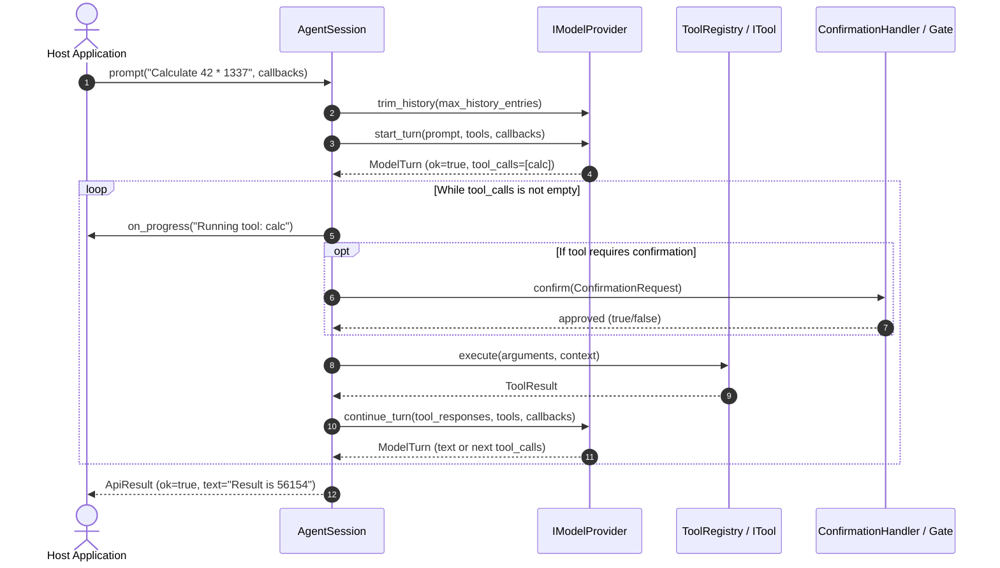

# ARN Core Architecture

**ARN Core** (`arn::core`) is a headless, modular C++23 framework providing the foundational orchestration engine for autonomous AI agents and interactive LLM applications.

This document describes the architectural philosophy, core subsystems, data flow, concurrency model, and security boundaries of the library.

---

## 1. Architectural Philosophy

ARN Core was designed with strict decoupling principles:

1. **Headless & UI-Agnostic**: Contains zero terminal UI, terminal emulation, REPL loops, or GUI code. It can be embedded within command-line tools, desktop applications (Qt, WinUI, Dear ImGui), game engines, or daemon servers.
2. **Provider-Agnostic**: All model interactions are abstracted through `IModelProvider`. Switching between Google Gemini, DeepSeek, OpenRouter, or local engines requires no changes to agent logic or tools.
3. **Policy-Free Security Boundary**: ARN Core does not impose filesystem sandboxes, arbitrary command bans, or privilege boundaries. Instead, it provides the hook primitives (`ConfirmationGate`, `ConfirmationRequest`, `ITool::requires_confirmation`) enabling host applications to enforce their own domain-specific policies.
4. **Resilient Streaming First**: Every model call supports incremental Server-Sent Events (SSE) streaming with robust exponential backoff, rate limit handling, and non-blocking cancellation.

---

## 2. Component Hierarchy

The system is structured into five cohesive subsystems under `include/arn/core/`:

```text
arn::core
│
├── Agent Layer (arn/core/agent/)
│   └── AgentSession, AgentConfig
│
├── Provider Layer (arn/core/provider/)
│   ├── IModelProvider
│   ├── GeminiProvider
│   ├── DeepSeekProvider
│   └── OpenRouterProvider
│
├── Tool Layer (arn/core/tool/)
│   ├── ITool, ToolDefinition, ToolResult, ToolContext
│   └── ToolRegistry
│
├── Confirmation Layer (arn/core/confirmation/)
│   ├── ConfirmationRequest, IConfirmationHandler, ConfirmationFn
│   └── ConfirmationGate
│
└── Networking Layer (arn/core/net/)
    ├── http_client (retry, backoff, streaming POST)
    ├── sse_decoder (incremental event parsing)
    └── model_parser (model catalog parsing)
```

---

## 3. Orchestration & Data Flow

When an application calls `AgentSession::prompt(...)`, ARN Core manages the interaction loop between the model provider, the tool registry, and the confirmation gate:



### Turn Loop Lifecycle
1. **History Pruning**: Before each turn, `AgentSession` calls `provider->trim_history(config.max_history_entries)` to keep context length within limits.
2. **Turn Initiation**: `provider->start_turn(...)` serializes the prompt, active system instructions, and tool definitions into the provider's specific wire format, dispatching a streaming HTTP request.
3. **Streaming & Delta Dispatch**: As SSE chunks arrive from the server, tokens are forwarded in real time to the caller's `on_text` callback.
4. **Tool Call Detection**: If the model response concludes with function calls instead of pure text, the provider populates `ModelTurn::tool_calls`.
5. **Execution & Confirmation**: `AgentSession` iterates through the requested tool calls:
   - If the tool requires confirmation, the registered `ConfirmationFn` is invoked.
   - The tool executes and yields a `ToolResult`.
6. **Turn Continuation**: Tool results are fed back to `provider->continue_turn(...)`. This cycle repeats up to `config.max_tool_rounds` (default 12) to prevent infinite loops.
7. **Completion**: When the model finishes without requesting further tools, the final text is returned in `ApiResult`.

---

## 4. Subsystems in Detail

### Subsystem 1: Agent Layer (`AgentSession`)
- **Header**: [`include/arn/core/agent/agent_session.hpp`](../include/arn/core/agent/agent_session.hpp)
- The high-level orchestrator. Holds the active configuration (`AgentConfig`), the tool registry (`ToolRegistry`), the confirmation callback, and the active provider reference.
- Serializes method invocations using an internal mutex while exposing lock-free request cancellation via `active_provider_`.

### Subsystem 2: Provider Layer (`IModelProvider`)
- **Header**: [`include/arn/core/provider/model_provider.hpp`](../include/arn/core/provider/model_provider.hpp)
- Encapsulates provider-specific JSON schemas, authentication headers, and multi-turn state (`contents_` for Gemini, `messages_` for DeepSeek and OpenRouter).
- Standard implementations:
  - `GeminiProvider`: Google Gemini REST API (`streamGenerateContent`).
  - `DeepSeekProvider`: DeepSeek OpenAI-compatible chat API.
  - `OpenRouterProvider`: OpenRouter gateway supporting hundreds of LLMs with automatic tool capability detection.

### Subsystem 3: Tool Layer (`ToolRegistry` & `ITool`)
- **Headers**: [`include/arn/core/tool/tool.hpp`](../include/arn/core/tool/tool.hpp), [`include/arn/core/tool/tool_registry.hpp`](../include/arn/core/tool/tool_registry.hpp)
- `ITool` defines a tool's contract: name, description, JSON Schema for parameters, confirmation requirement, and `execute()` method.
- `ToolRegistry` aggregates tools, produces model-ready JSON declarations via `definitions_json()`, and safely dispatches execution requests by name.

### Subsystem 4: Confirmation Layer (`ConfirmationGate`)
- **Headers**: [`include/arn/core/confirmation/confirmation_request.hpp`](../include/arn/core/confirmation/confirmation_request.hpp), [`include/arn/core/confirmation/confirmation_gate.hpp`](../include/arn/core/confirmation/confirmation_gate.hpp)
- Bridges synchronous tool execution threads with asynchronous human-approval workflows (terminal prompts, GUI popups, or external webhooks).
- Generates unguessable token nonces, blocking worker threads with timeouts until the approval is submitted via `ConfirmationGate::answer()`.

### Subsystem 5: Networking Layer (`arn::core::net`)
- **Headers**: [`include/arn/core/net/http_client.hpp`](../include/arn/core/net/http_client.hpp), [`include/arn/core/net/sse_decoder.hpp`](../include/arn/core/net/sse_decoder.hpp)
- Handles HTTP transport via `cpp-httplib` with built-in TLS/OpenSSL support.
- Implements exponential backoff with jitter and respects `Retry-After` HTTP headers.
- Guarantees streaming replay safety: once an SSE event payload has reached the consumer, transport retries are suppressed to prevent duplicate text output.

---

## 5. Concurrency & Lifetime Model

| Object | Ownership / Lifetime | Thread-Safety Guarantees |
|---|---|---|
| `AgentSession` | Movable, non-copyable. Owned by host application. | Method calls are serialized internally via mutex. `cancel_active_request()` is safe to invoke concurrently from any thread. |
| `ToolRegistry` | Shared via `std::shared_ptr<const ToolRegistry>`. | Immutable once attached to a session during prompt execution. Thread-safe for concurrent read access across sessions. |
| `ITool` | Stored as `std::shared_ptr<ITool>` in `ToolRegistry`. | `execute()` must be re-entrant if shared among concurrent sessions. |
| `IModelProvider` | May be owned by `AgentSession` or passed as non-owning pointer. | Single-session usage recommended. Mutex-protected within session turns. |
| `ConfirmationGate` | Owned by host application or tool. | Fully thread-safe. Multiple threads can wait and answer concurrently. |

### Concurrency Design for Cancellation
When a long-running prompt or tool is executing:
1. `AgentSession::prompt(...)` sets an internal atomic pointer `active_provider_`.
2. A separate UI or signal-handling thread calls `session.cancel_active_request()`.
3. `cancel_active_request()` reads `active_provider_.load(std::memory_order_acquire)` and signals the active provider's HTTP socket and cancellation flag without attempting to acquire the session lock.
4. The worker thread detects cancellation, stops streaming, and returns `ApiResult{ .ok = false, .cancelled = true }`.

---

## 6. Security Model & Responsibilities

ARN Core intentionally defines a clear separation of concerns between library and application:

| Responsibility | ARN Core (`arn::core`) | Consuming Application (e.g. ARN CLI, Custom UI) |
|---|---|---|
| Tool execution hooks | Dispatches arguments to `ITool::execute()` | Validates arguments, sanitizes file paths, checks permissions |
| Confirmation primitives | Generates tokens, blocks worker threads, coordinates answers | Renders confirmation UI, shows diffs, prompts user |
| Operating System interaction | None | Executes processes, sandboxes commands, manages chroot/jail |
| Secrets & API Keys | Stores keys in memory for active session requests | Retrieves keys from environment/keyrings, avoids persistent disk leakage |

> [!WARNING]
> ARN Core does not restrict filesystem access or command execution. If you expose tools that interact with the local operating system, your `ITool` implementations MUST sanitize input and require human confirmation via `ConfirmationRequest`.
