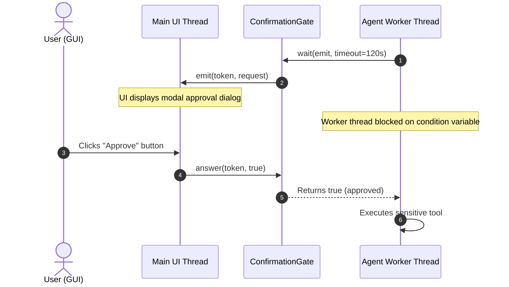

# Human-in-the-Loop Confirmations

Autonomous agents operating on the real world often execute actions with irreversible consequences: writing files, dropping database tables, making financial transactions, or invoking shell processes.

ARN Core provides a decoupled confirmation subsystem that allows applications to intercept sensitive actions and demand user approval before execution proceeds.

**Headers**:
- Requests and handlers: [`include/arn/core/confirmation/confirmation_request.hpp`](../include/arn/core/confirmation/confirmation_request.hpp)
- Synchronous/asynchronous gate: [`include/arn/core/confirmation/confirmation_gate.hpp`](../include/arn/core/confirmation/confirmation_gate.hpp)
- Convenience include: [`include/arn/core/confirmation/confirmation_handler.hpp`](../include/arn/core/confirmation/confirmation_handler.hpp)

---

## 1. Core Abstractions

### 1.1. `ConfirmationRequest`

Carries contextual information about the pending action:

```cpp
struct ConfirmationRequest {
    /// Name of the tool requesting approval.
    std::string name;

    /// Invocation arguments provided by the model.
    nlohmann::json arguments;

    /// Human-readable summary of the action to be performed.
    std::string summary;

    /// Indicates whether the action modifies persistent state or external resources.
    bool changes_state{false};

    /// Compatibility alias indicating filesystem modification.
    bool changes_files{false};

    /// Optional structured preview data (e.g. diffs, shell commands, affected URLs).
    nlohmann::json preview;
};
```

### 1.2. `IConfirmationHandler` & `ConfirmationFn`

Consumers receive approval requests via either an interface implementation or a standard callback function:

```cpp
// Pure virtual interface
class IConfirmationHandler {
public:
    virtual ~IConfirmationHandler() = default;
    [[nodiscard]] virtual bool confirm(const ConfirmationRequest& request) = 0;
};

// Callable type
using ConfirmationFn = std::function<bool(const ConfirmationRequest&)>;

// Adapter wrapping an interface instance into a callable
ConfirmationFn fn = arn::core::make_confirmation_fn(my_handler);
```

Attach your confirmation handler to an `AgentSession`:

```cpp
session.set_confirmation_handler(fn);
```

---

## 2. Confirmation Patterns

### Pattern A: Synchronous CLI Confirmation

In command-line applications, the prompt thread can pause and read from standard input directly:

```cpp
#include <iostream>
#include <arn/core/confirmation/confirmation_request.hpp>

arn::core::ConfirmationFn cli_confirm = [](const arn::core::ConfirmationRequest& req) -> bool {
    std::cout << "\n================ ACTION APPROVAL REQUIRED ================\n"
              << "Tool:    " << req.name << "\n"
              << "Summary: " << req.summary << "\n";

    if (!req.preview.is_null()) {
        std::cout << "Preview:\n" << req.preview.dump(2) << "\n";
    }

    std::cout << "--------------------------------------------------------\n"
              << "Approve this operation? [y/N]: " << std::flush;

    std::string input;
    if (!std::getline(std::cin, input)) {
        return false;
    }

    return !input.empty() && (input[0] == 'y' || input[0] == 'Y');
};

session.set_confirmation_handler(cli_confirm);
```

---

### Pattern B: Asynchronous GUI / Event Loop (`ConfirmationGate`)

In graphical desktop applications (Qt, WinUI, Dear ImGui) or client-server architectures, the agent thread runs in the background and must not block the main UI loop with standard I/O.

The `arn::core::ConfirmationGate` coordinates this synchronization:



#### Complete Implementation Example

```cpp
#include <iostream>
#include <thread>
#include <arn/core/confirmation/confirmation_gate.hpp>
#include <arn/core/confirmation/confirmation_request.hpp>

// Shared gate instance
arn::core::ConfirmationGate approval_gate;

// 1. Tool execution callback (runs on background Agent worker thread)
arn::core::ConfirmationFn async_confirm = [&](const arn::core::ConfirmationRequest& req) -> bool {
    std::cout << "[Agent Thread] Demanding approval for tool: " << req.name << '\n';

    // wait() assigns a unique token, invokes emit, and blocks the worker thread
    bool approved = approval_gate.wait([&](const std::string& token) {
        // Post an event to the UI thread with the token and request details
        std::cout << "[UI Thread Dispatch] Pending request token: " << token << '\n';
        std::cout << "[UI Thread Dispatch] Action: " << req.summary << '\n';
    }, std::chrono::seconds(60));

    std::cout << "[Agent Thread] Outcome: " << (approved ? "APPROVED" : "REJECTED") << '\n';
    return approved;
};

// 2. UI Action Handler (runs on UI or RPC thread when user clicks Approve/Deny)
void on_user_clicked_approve(const std::string& token) {
    approval_gate.answer(token, true);
}

void on_user_clicked_reject(const std::string& token) {
    approval_gate.answer(token, false);
}

void on_user_closed_window() {
    approval_gate.cancel(); // Wakes any waiting threads with false
}
```

#### Gate Features
- **Token Isolation**: Each `wait()` call generates a unique cryptographic nonce token (`change-<nonce>-<seq>`). Late or misdirected answers targeting invalid or expired tokens are rejected.
- **Configurable Timeouts**: Specify a maximum wait duration (default 120 seconds). If the user does not respond within the timeout, `wait()` unblocks and returns `false`.
- **Thread-Safe Cancellation**: Invoking `gate.cancel()` immediately unblocks waiting threads with `false`. Call `gate.reset()` before processing subsequent requests.

---

### Pattern C: Automated Policy Engine

Applications can evaluate automated safety policies before prompting the user:

```cpp
class PolicyEngineHandler final : public arn::core::IConfirmationHandler {
public:
    bool confirm(const arn::core::ConfirmationRequest& req) override {
        // Rule 1: Read-only operations never require approval
        if (!req.changes_state && !req.changes_files) {
            return true;
        }

        // Rule 2: Deny forbidden system paths automatically
        if (req.arguments.contains("path")) {
            std::string path = req.arguments["path"].get<std::string>();
            if (path.starts_with("/etc") || path.starts_with("C:\\Windows")) {
                return false; // Denied by policy
            }
        }

        // Rule 3: Escalate to interactive user confirmation
        return prompt_user_dialog(req);
    }

private:
    bool prompt_user_dialog(const arn::core::ConfirmationRequest& req) {
        // Interactive prompt logic...
        return true;
    }
};
```

---

## 3. Tool-Level Integration

A tool indicates that it requires confirmation by overriding `ITool::requires_confirmation()`:

```cpp
class ExecuteCommandTool final : public arn::core::ITool {
public:
    const arn::core::ToolDefinition& definition() const noexcept override {
        static const arn::core::ToolDefinition def{
            .name = "execute_command",
            .description = "Executes an operating system shell command.",
            .parameter_schema = {
                {"type", "object"},
                {"properties", {{"command", {{"type", "string"}}}}},
                {"required", {"command"}}
            }
        };
        return def;
    }

    bool requires_confirmation() const noexcept override {
        return true; // Demands approval before execution
    }

    arn::core::ToolResult execute(const nlohmann::json& args,
                                  const arn::core::ToolContext& context) override {
        const std::string cmd = args["command"].get<std::string>();

        // Construct structured request
        arn::core::ConfirmationRequest req(
            "execute_command",
            args,
            "Run shell command: " + cmd,
            /*changes_state=*/true,
            /*changes_files=*/false,
            /*preview=*/nlohmann::json{{"command", cmd}}
        );

        if (context.confirm && !context.confirm(req)) {
            return arn::core::ToolResult::failure("Execution of command was denied by the user.");
        }

        // Execute command...
        return arn::core::ToolResult::success({{"stdout", "Command executed."}});
    }
};
```
