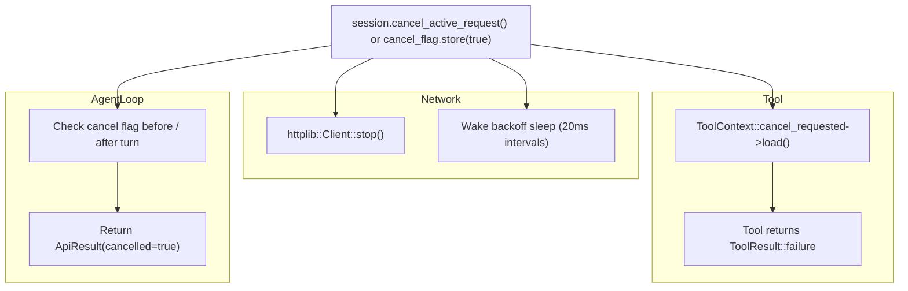

# Streaming & Cancellation

Modern AI user experiences demand real-time token delivery and responsive cancellation controls. ARN Core was engineered from the ground up for low-latency streaming and cooperative cancellation across network calls, tool executions, and turn loops.

**Headers**:
- HTTP streaming & retry: [`include/arn/core/net/http_client.hpp`](../include/arn/core/net/http_client.hpp)
- SSE decoder: [`include/arn/core/net/sse_decoder.hpp`](../include/arn/core/net/sse_decoder.hpp)
- Streaming types: [`include/arn/core/provider/model_provider.hpp`](../include/arn/core/provider/model_provider.hpp)

---

## 1. Streaming Callbacks

Streaming in ARN Core is driven by two callback signatures grouped inside `arn::core::StreamCallbacks`:

```cpp
/// Invoked on the prompt thread as incremental text tokens arrive from the model.
using TextStreamCallback = std::function<void(std::string_view text_delta)>;

/// Invoked when background milestones occur (retries, backoff delays, tool execution).
using ProgressCallback = std::function<void(std::string_view progress_message)>;

struct StreamCallbacks {
    TextStreamCallback on_text;
    ProgressCallback on_progress;
};
```

### Usage Example

```cpp
arn::core::StreamCallbacks callbacks{
    .on_text = [](std::string_view delta) {
        // Render token immediately to console or UI widget
        std::cout << delta << std::flush;
    },
    .on_progress = [](std::string_view message) {
        // Update a status bar or spinner
        std::cerr << "\n[Status: " << message << "]\n";
    }
};

session.prompt("Explain quantum entanglement.", callbacks);
```

---

## 2. Server-Sent Events: `SseDecoder`

Providers stream chunks over HTTP using Server-Sent Events (`text/event-stream`). The `arn::core::net::SseDecoder` class incrementally reconstructs JSON payloads across arbitrary network read boundaries.

### Design Highlights
- **Zero-Allocation Chunking**: Extracts lines delimited by `\n` or `\r\n` directly from the stream.
- **Prefix Handling**: Strips `data:` and `data: ` headers according to the SSE standard.
- **Buffer Safety**: If a chunk ends in the middle of a multibyte UTF-8 sequence or JSON token, trailing bytes remain buffered in `pending_` until the next network read completes the payload.
- **Trailing Flush**: `finish()` processes any final event if the server abruptly closes the connection without a trailing empty line.

```cpp
#include <arn/core/net/sse_decoder.hpp>

arn::core::net::SseDecoder decoder;

// Feed network chunks as they arrive
decoder.push(socket_chunk, [](std::string_view event_data) {
    if (event_data == "[DONE]") return;
    auto json = nlohmann::json::parse(event_data);
    // Process candidate or choices...
});

// Finalize at stream end
decoder.finish([](std::string_view event_data) {
    // Process any remaining event...
});
```

---

## 3. Resilient Networking & Replay Prevention

LLM APIs can experience transient connection drops, server overloads (HTTP 503), or rate limits (HTTP 429). ARN Core provides built-in resilience utilities:

### Retry Strategy & Exponential Backoff
- **`should_retry(response)`**: Inspects `httplib::Result`. Returns `true` for connection dropouts, null responses, status code 429, and 5xx server errors.
- **`retry_delay(response, attempt)`**:
  - If the server sends a `Retry-After` HTTP header, that delay is respected.
  - Otherwise, computes exponential backoff ($2^{\text{attempt}} \times 1\text{s}$) with randomized jitter to prevent thundering herd problems.

### Streaming Replay Guard (`received_event`)

> [!IMPORTANT]
> If an HTTP connection drops **after** one or more tokens have already been delivered to the user's `on_text` callback, retrying the HTTP request from scratch would reprint duplicate text on the user's screen.
>
> `arn::core::net::execute_stream_with_retry` tracks a `received_event` boolean flag. If any event has been decoded and emitted, retries are immediately suppressed on error, returning the failure cleanly to the application layer.

```cpp
template <typename RequestFn, typename ProgressFn = ProgressCallback>
auto execute_stream_with_retry(RequestFn&& request, const bool& received_event,
                               const std::atomic_bool* cancel_requested = nullptr,
                               const ProgressFn& on_progress = {},
                               int max_attempts = max_request_attempts);
```

---

## 4. Cancellation Architecture

ARN Core supports non-blocking cancellation at three levels:
1. **Network Layer**: Interrupting in-flight HTTP socket operations.
2. **Tool Layer**: Terminating long-running tools before they execute further steps.
3. **Session Loop Layer**: Breaking out of multi-round tool loops.



---

## 5. Cancellation Implementation Techniques

### Technique 1: Cooperative Token (`std::atomic_bool`)

Pass a pointer to an atomic boolean when calling `prompt()`:

```cpp
std::atomic_bool cancel_flag{false};

std::thread worker([&]() {
    auto res = session.prompt("Search the entire archive", callbacks, &cancel_flag);
    if (res.cancelled) {
        std::cout << "\nOperation aborted.\n";
    }
});

// Trigger cancellation from any thread:
cancel_flag.store(true);
worker.join();
```

### Technique 2: Active Request Abort (`cancel_active_request()`)

`AgentSession::cancel_active_request()` can be called concurrently from UI event loops, Ctrl+C signal handlers, or timeout threads without holding the session mutex:

```cpp
// Instantly closes the in-flight HTTP socket and marks provider cancelled
session.cancel_active_request();
```

Inside the provider implementation, `cancel_active_request()` calls `client_->stop()` on the underlying `httplib::Client`, immediately terminating pending TCP socket reads or writes.
